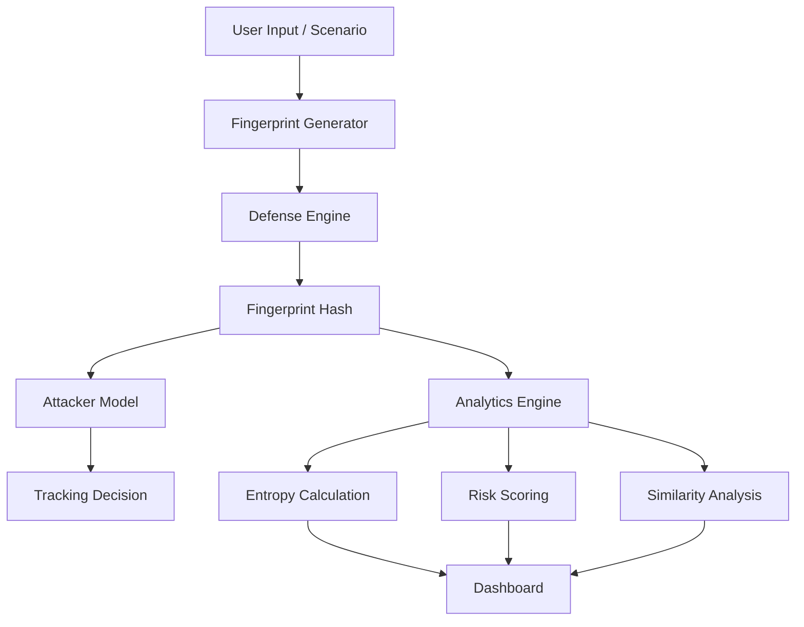

# 🛡️ Browser Fingerprinting Cyber Range Simulator

A GUI-based **Cyber Range as a Service (CRaaS)** simulation that demonstrates how websites track users using **browser fingerprinting** and evaluates **privacy defense mechanisms** using entropy-based analytics.


## 🚀 Overview

This project simulates:

* 🔴 **Attack** → Browser fingerprint generation & tracking
* 🟢 **Defense** → Randomization & spoofing techniques
* 🧠 **Analytics** → Entropy, risk scoring, and tracking success
* 📊 **Visualization** → Graphs, heatmaps, and comparison models

It provides a **controlled environment (cyber range)** for experimenting with tracking techniques and privacy protections.


## 🎯 Key Features

### 🔐 Attack Simulation

* Fingerprint generation using device attributes
* Multi-session tracking simulation
* Stateless tracking (no cookies)

### 🛡️ Defense Mechanisms

* Randomization of attributes
* Spoofing (standardized profiles)

### 🎯 Attacker Models

* Passive tracker
* Advanced tracker (exact matching)
* Correlation attacker (similarity-based tracking)

### 📊 Analytics Engine

* Shannon entropy calculation
* Weighted entropy (risk model)
* Risk score normalization (0–100)
* Tracking success rate

### 📈 Visualization

* Risk trend graphs
* Heatmap (attribute diversity)
* Comparison charts (defense effectiveness)
* Session replay (side-by-side comparison)

### 🧪 Advanced Features

* Scenario simulation
* Demo mode (auto-run sessions)
* Attribute contribution analysis
* Risk intelligence panel


## 🧠 System Architecture




## 📊 Risk Model

The system uses **Shannon Entropy** to measure fingerprint uniqueness:

[
H = -\sum p(x)\log_2 p(x)
]

### Weighted Entropy

Each attribute contributes differently:

| Attribute         | Weight |
| ----------------- | ------ |
| Screen Resolution | 2      |
| Fonts             | 2      |
| Timezone          | 1.5    |
| OS                | 1      |
| CPU / Memory      | 1      |

---

### Risk Score

[
Risk = \frac{Entropy}{MaxEntropy} \times 100
]

| Score  | Risk Level |
| ------ | ---------- |
| 0–30   | Low        |
| 30–70  | Medium     |
| 70–100 | High       |


## 🔗 Similarity-Based Tracking

Instead of strict matching:

[
Similarity = \frac{Matching Attributes}{Total Attributes} \times 100
]

* Enables **correlation attacks**
* Detects users even after small changes


## ▶️ Installation

```bash
pip install streamlit matplotlib
```


## ▶️ Run the Project

```bash
streamlit run app.py
```


## 🧪 How to Use

1. Select:

   * Defense Mode
   * Attacker Model

2. Run:

   * Single session
   * Auto demo (multi-session simulation)

3. Navigate tabs:

   * **Attack** → fingerprint + tracking result
   * **Analytics** → entropy + risk + graphs
   * **Replay** → compare sessions
   * **Comparison** → evaluate defenses


## 📸 Screenshots

> Add screenshots here (recommended for GitHub)


## 🧠 Key Insights

* Browser fingerprinting enables **stateless tracking**
* Higher entropy → higher uniqueness → easier tracking
* Defense techniques reduce entropy and tracking success
* Correlation attackers are more powerful than exact-match trackers


## ⚠️ Limitations

* Uses simulated attributes (not real browser APIs)
* No canvas/WebGL fingerprinting
* Simplified attacker models
* Limited dataset size


## 🔮 Future Improvements

* Real browser fingerprint collection
* Machine learning-based tracking detection
* Network-level fingerprinting
* Advanced dashboards


## 🛠️ Tech Stack

* Python
* Streamlit
* Matplotlib
esentation script (what to say in demo)**
